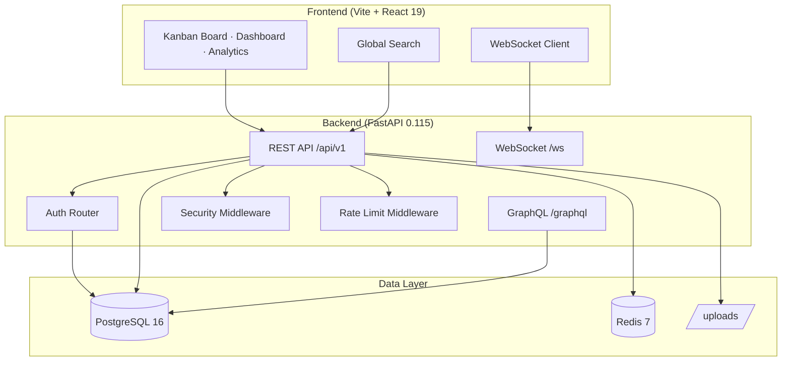

# CloudBoard 🚀

> **Engineering Intelligence Platform** — A full-stack MVP for AI-assisted project management, real-time collaboration, and team observability.


---

## Architecture



---

## Features

| Module | Feature | Status |
|--------|---------|--------|
| Auth | JWT (access + refresh), Argon2id, OAuth skeleton | ✅ |
| Orgs | Organizations, RBAC (Owner/Admin/Developer/Viewer), Invitations | ✅ |
| Projects | Project CRUD with org scoping | ✅ |
| Tasks | Kanban board (Todo/Doing/Done), Subtasks, Comments | ✅ |
| Real-time | WebSocket task events, broadcast | ✅ |
| Search | Full-text search across tasks, users, projects | ✅ |
| Attachments | File upload with MIME whitelist + size guard | ✅ |
| GraphQL | Strawberry schema: tasks query + mutation | ✅ |
| Security | CSRF, security headers, input sanitizer, audit logs | ✅ |
| Observability | Prometheus metrics, health checks, audit trail | ✅ |
| AI Co-Pilot | Gemini API integration for task suggestions | ✅ |
| Testing | pytest (unit + integration), Vitest, Playwright E2E | ✅ |

---

## Quick Start

### Prerequisites

- Docker + Docker Compose
- Node.js ≥ 20
- Python 3.12+

### 1. Start the Backend Stack

```bash
# Clone the repo
git clone https://github.com/SaraCh28/CloudBoard.git
cd CloudBoard

# Start PostgreSQL + Redis + API (hot-reload via override)
docker-compose up --build
```

Backend API: **http://localhost:8005**  
API Docs: **http://localhost:8005/docs**

### 2. Start the Frontend

```bash
npm install
npm run dev
```

Frontend: **http://localhost:5173**

### 3. Production Deploy

```bash
docker-compose -f docker-compose.yml -f docker-compose.prod.yml up -d
```

---

## Environment Variables

Copy `.env.example` to `.env` and fill in values:

| Variable | Default | Description |
|----------|---------|-------------|
| `DATABASE_URL` | `postgresql+asyncpg://...` | PostgreSQL connection string |
| `REDIS_URL` | `redis://localhost:6379/0` | Redis connection string |
| `JWT_SECRET_KEY` | `change-me` | ⚠️ Must be random 64-char hex in production |
| `ACCESS_TOKEN_EXPIRE_MINUTES` | `30` | Access token lifetime |
| `REFRESH_TOKEN_EXPIRE_DAYS` | `7` | Refresh token lifetime |
| `CORS_ORIGINS` | `["http://localhost:5173"]` | Allowed CORS origins (JSON list) |
| `GOOGLE_CLIENT_ID` | `""` | Google OAuth app client ID |
| `GOOGLE_CLIENT_SECRET` | `""` | Google OAuth app client secret |
| `GEMINI_API_KEY` | `""` | Google Gemini AI API key |
| `ENVIRONMENT` | `development` | `development` \| `staging` \| `production` |

Generate a secure JWT secret:
```bash
openssl rand -hex 64
```

---

## Testing

### Backend (pytest + coverage)

```bash
cd backend
pip install -r requirements.txt pytest-cov pytest-asyncio aiosqlite httpx
pytest tests/ -v
# Coverage report: htmlcov/index.html
```

### Frontend (Vitest)

```bash
npm test               # Run once
npm run test:watch     # Watch mode
```

### E2E (Playwright)

```bash
# Install browsers once
npx playwright install --with-deps

# Run E2E (requires dev server + backend running)
npm run dev &
npm run test:e2e
```

---

## API Reference

### Authentication

| Method | Path | Description |
|--------|------|-------------|
| `POST` | `/api/v1/auth/register` | Create account (returns JWT pair) |
| `POST` | `/api/v1/auth/login` | Login (returns JWT pair) |
| `POST` | `/api/v1/auth/refresh` | Exchange refresh token |
| `POST` | `/api/v1/auth/logout` | Logout (audit entry) |
| `POST` | `/api/v1/auth/change-password` | Change password |
| `GET`  | `/api/v1/auth/me` | Current user profile |
| `GET`  | `/api/v1/auth/google` | OAuth redirect URL |

### Tasks

| Method | Path | Description |
|--------|------|-------------|
| `GET`  | `/api/v1/tasks?skip=0&limit=50` | List tasks (paginated) |
| `POST` | `/api/v1/tasks` | Create task |
| `PUT`  | `/api/v1/tasks/{id}` | Update task |
| `DELETE` | `/api/v1/tasks/{id}` | Delete task |

### System

| Method | Path | Description |
|--------|------|-------------|
| `GET`  | `/health` | Basic health check |
| `GET`  | `/api/v1/version` | Build metadata |
| `GET`  | `/api/v1/system/health` | Detailed health (DB, cache, WS) |
| `GET`  | `/api/v1/system/metrics` | Prometheus text metrics |
| `GET`  | `/api/v1/system/logs` | Paginated audit log |

Full interactive docs: **http://localhost:8005/docs**

---

## Database Migrations

```bash
cd backend

# Apply all pending migrations
alembic upgrade head

# Rollback one step
alembic downgrade -1

# Generate a new migration (after model changes)
alembic revision --autogenerate -m "describe_your_change"
```

---

## Backup & Restore

```bash
# Backup (outputs to ./backups/)
./scripts/backup.sh

# Restore from a specific backup file
./scripts/restore.sh ./backups/cloudboard_20260726_120000.sql.gz
```

---

## Security

- **Passwords**: Argon2id hashed (OWASP #1 recommendation)
- **Tokens**: JWT HS256, 30-min access / 7-day refresh
- **CSRF**: Double-submit cookie pattern
- **Headers**: CSP, HSTS, X-Frame-Options, X-Content-Type-Options, Permissions-Policy
- **Rate Limiting**: Sliding window (120 req/min default)
- **Input**: XSS sanitizer on all user-supplied strings
- **Files**: MIME-type whitelist + extension matching + 10 MB limit
- **Audit Log**: All auth actions written to `audit_logs` table

---

## Architecture Decision Records

| ADR | Decision |
|-----|----------|
| [ADR 001](docs/adr/001-argon2-password-hashing.md) | Argon2id for password hashing |
| [ADR 002](docs/adr/002-jwt-refresh-token-strategy.md) | Dual-token JWT strategy |
| [ADR 003](docs/adr/003-sqlite-for-testing.md) | SQLite for test environment |
| [ADR 004](docs/adr/004-docker-compose-env-separation.md) | Docker Compose env separation |

---

## Project Structure

```
CloudBoard/
├── backend/
│   ├── app/
│   │   ├── auth/           # JWT, argon2, RBAC
│   │   ├── middleware/     # Security headers, CSRF, rate limiting
│   │   ├── models/         # SQLAlchemy models (User, Task, AuditLog…)
│   │   ├── routers/        # FastAPI route handlers
│   │   └── services/       # Cache, Audit
│   ├── alembic/versions/   # Database migrations
│   ├── tests/              # pytest unit + integration suite
│   └── pytest.ini
├── src/
│   ├── components/         # React components (Kanban, Dashboard…)
│   └── __tests__/          # Vitest component + hook tests
├── e2e/                    # Playwright E2E specs
├── scripts/                # backup.sh / restore.sh
├── docs/adr/               # Architecture Decision Records
├── docker-compose.yml
├── docker-compose.override.yml   # Dev overrides (auto-applied)
└── docker-compose.prod.yml       # Production overrides
```

---

## License

MIT © 2026 CloudBoard Engineering Team
